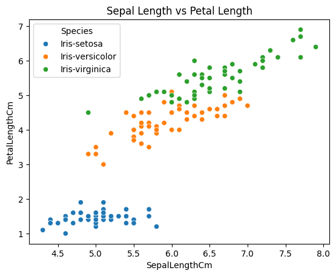
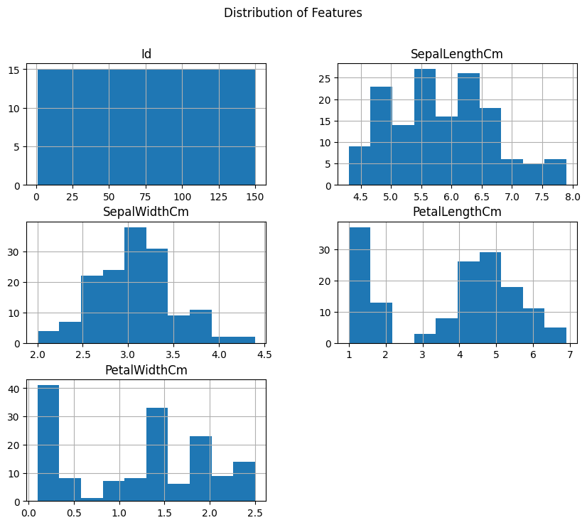
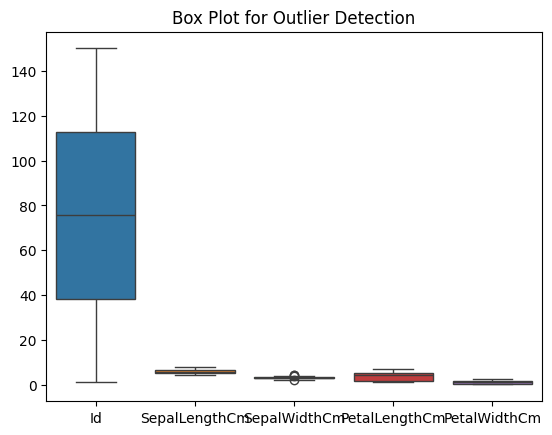

# Iris Dataset — Exploratory Data Analysis

Exploratory analysis of the classic Iris dataset to understand
feature distributions, species relationships, and outliers
using Python visualization libraries.

---

## Objective
Load, inspect, and visualize the Iris dataset to discover
data trends, distributions, and patterns across species.

## Dataset
- **Name:** Iris Dataset
- **Format:** CSV
- **Size:** 150 rows × 6 columns
- **Features:** SepalLengthCm, SepalWidthCm,
               PetalLengthCm, PetalWidthCm, Species

## Libraries Used
| Library | Purpose |
|---|---|
| Pandas | Data loading and inspection |
| Matplotlib | Plot rendering |
| Seaborn | Scatter plots and box plots |

## Analysis Performed
- Inspected shape, columns, and first rows with `.head()`
- Used `.info()` and `.describe()` for summary statistics
- **Scatter plot** — Sepal vs Petal Length by Species
- **Histograms** — Distribution of all numeric features
- **Box plots** — Outlier detection across features

## Visualizations

### Scatter Plot


### Histograms


### Box Plot


## Key Findings
- Petal Length and Petal Width are the strongest features
  for separating species
- Setosa is clearly separable from Versicolor and Virginica
- Versicolor and Virginica show slight overlap in sepal features
- Sepal Width has the most outliers across all features

## How to Run
```bash
git clone https://github.com/YOUR-USERNAME/iris-data-analysis.git
cd iris-data-analysis
pip install pandas matplotlib seaborn
jupyter notebook iris_eda.ipynb
```
